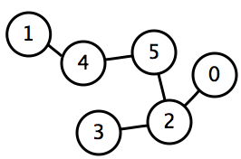
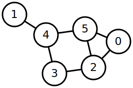

# Find the Cycles

Both Trees and Graphs consist of Nodes pointing to each other. In fact, a tree is just a type of graph that contains no cycles. A cycle means you can leave a node along one path and return to it on a different path. Can you determine if there are any cycles in a graph?

No Cycles in this Graph:



But there are multiple Cycles in this Graph:



# Challenge

Return true if the graph has a cycle and false otherwise.

# Example

```ruby
graph = {
0=>[2],
1=>[4],
2=>[0, 5, 3],
3=>[5, 2],
4=>[5, 1],
5=>[4, 2, 3]
}

puts graph_cycle?(graph)
# => true
```
