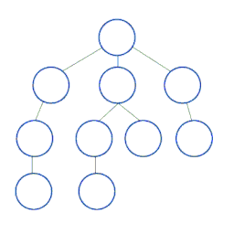

# Breadth-First Search

BFS begins at one node in a graph and visits all the neighboring nodes. It then goes to each of those neighbors to explore their unvisited neighbors in order. So it goes through the entire graph one level at a time, until the whole graph has been visited.



BFS goes through the Nodes one level at a time, so you need a structure to keep track of the next nodes to be processed.

> **Q**: What structure can be used to access items in the order they were put in?
>
> **A**: A Queue

## Challenge

Return an array with the given graph in BFS order.

## Sample Input

```ruby
graph = {
  0 => [2],
  1 => [4],
  2 => [5, 0, 3],
  3 => [2],
  4 => [1, 5],
  5 => [4, 2]
}

bfs(graph)
# => [0, 2, 5, 3, 4, 1]
```
