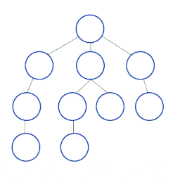

# DFS Algorithm

DFS goes through a graph as far as possible in one direction before backtracking to other nodes. DFS is similar to the pre-order tree traversal, but you need to make sure you don't get stuck in a loop. To do this, you'll need to keep track of which Nodes have been visited.



## Challenge

Create a graph from the given input and Run through it with a Depth-first-search. Return an Array with the nodes in the order you first visit them. Visit the first adjacent Node in the input before going on to the other nodes.

### Example

```ruby
graph = {
  0 => [2],
  1 => [4],
  2 => [5, 0, 3],
  3 => [2],
  4 => [1, 5],
  5 => [4, 2]
}

depth_first_search(graph)
# => [0, 2, 5, 4, 1, 3]
```

### Explanation

For this challenge, visit equivalent nodes in the same order as their input. For example, 5 comes before 3 in the output since it was before 3 in the input.
