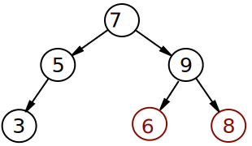

# Is it a Search Tree?

Given a binary tree, can you determine if it is a proper Binary Search Tree?

In a binary search tree, every descendant to the right of node P must be greater than P, and every descendant to the left of P must be less than P.

The input will be given as a list, as in the previous exercises.

Here's a good Binary Search Tree:


...and here's a bad one:



This tree is not a proper BST for 2 reasons:

- The 8 is smaller than the 9, even though it is in a right subtree of 9.
- The 6 is smaller than the 7, even though it is in a right subtree of 7.

## Challenge

Return true if the given tree is a proper binary search tree, and false otherwise.

## Example

```ruby
tree = [10, 4, 12]

search_tree?(tree)
# => true
```
